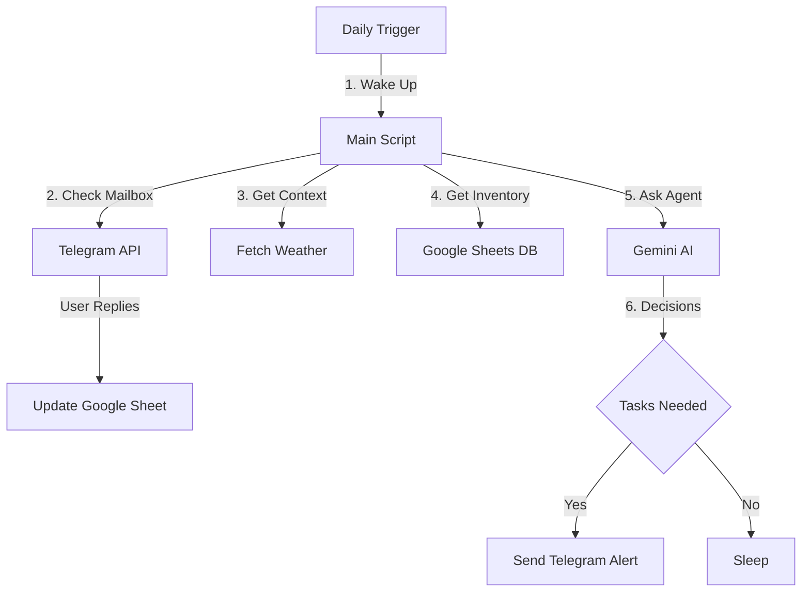

# 🌱 Shakahari

**Shakahari** is a serverless, agent-driven plant care system that runs for **$0/month**.

Unlike dumb timer apps, Shakahari uses **Gemini 2.5 Flash** (AI), **Open-Meteo** (Weather), and **Google Sheets** (Memory) to intelligently manage the watering and fertilization schedules for your entire garden. It adjusts automatically for rain, heatwaves, seasons, and plant types.

## ✨ Features

- **🧠 Context-Aware Agent:** Analyzes recent rain history, temperature forecasts, and specific plant hardiness to decide if care is _actually_ needed.
- **📖 Plant-Specific Guidelines:** Uses [Perenual API](https://perenual.com) to fetch watering frequency for 10,000+ plant species.
- **📅 Days Tracking:** Calculates days since each action type (WATER, MIST, ROTATE, etc.) from CareHistory.
- **🛡️ Safety Filters:** Won't recommend watering if < 3 days since last watering, rotating if < 7 days, etc.
- **🌦️ Weather Integrated:** Automatically skips watering outdoor plants if it rained.
- **💬 Two-Way Feedback:** Receive tasks via **Telegram**. Reply with "Done" or "Watered Fern, Rotated Pothos" for composite updates.
- **📂 Serverless:** Runs on a scheduled GitHub Action (Cron). No AWS/GCP bills.


## 🏗️ Architecture



## 🛠️ Prerequisites

You will need free accounts for the following services:

1. **Google Cloud Project:** For the Gemini API and Google Sheets API.
2. **Telegram:** To create the bot.
3. **GitHub:** To host the code and run the runner.

## 🚀 Installation & Setup

### 1. Database Setup (Google Sheets)

1. Create a new Google Sheet named `ShakahariDB`.
2. Rename the first tab to `Plants`.
3. Add the following headers:

   | Name | Environment | Light | Humidity | Notes | Last Watered | Last Fertilized | Status |
   |------|-------------|-------|----------|-------|--------------|-----------------|--------|

   - **Environment**: `indoor`, `outdoor`, `balcony`, or `greenhouse`
   - **Light**: `direct`, `indirect`, `low`, or `shade`
   - **Humidity**: `low`, `medium`, or `high`

4. **CareHistory Tab** (auto-created on first run):

   | Date | Plant | Action | Notes |
   |------|-------|--------|-------|

   This tab logs all care actions you confirm, giving the AI context to avoid recommending recently-performed tasks.

5. **Important:** Create a **Service Account** in Google Cloud Console, download the JSON key, and **share** your Google Sheet with the service account's email address (Editor access).

### 2. Telegram Bot Setup

1. Open Telegram and chat with **@BotFather**.
2. Send `/newbot` to create a bot and get your **API Token**.
3. Send a message to your new bot.
4. Visit `https://api.telegram.org/bot<YOUR_TOKEN>/getUpdates` to find your `chat_id`.

### 3. Repository Configuration

1. Clone this repository.
2. Go to **Settings > Secrets and variables > Actions** in your GitHub repo.
3. Add the following Repository Secrets:

   | Secret Name | Value |
   |-------------|-------|
   | `GEMINI_API_KEY` | Your Google AI Studio API Key |
   | `TELEGRAM_TOKEN` | Your Bot Token from BotFather |
   | `TELEGRAM_CHAT_ID` | Your personal Chat ID |
   | `G_SHEET_CREDENTIALS` | The **entire content** of your Service Account JSON file |

### 4. Code Configuration

Open `src/config.py` and update your location:

```python
LATITUDE = 34.05  # Your Latitude
LONGITUDE = -118.25 # Your Longitude
SHEET_NAME = "ShakahariDB" # The google sheet name
```

### 5. Deploy

Push your code to GitHub. The workflow is defined in `.github/workflows/daily.yml` and is set to run automatically every morning (default: 14:00 UTC).

## 📱 Usage Guide

### The Daily Notification

Every morning, if action is required, Shakahari sends you a digest grouped by action type:

> 🌿 **Plant Care Tasks (2026-01-22)**  
>_All plants generally healthy._
>
> 💧 **WATER**: Monstera, Peace Lily, Fern  
> 🔄 **ROTATE**: Pothos  
> 🧪 **FERTILIZE**: Fiddle Leaf 
>
> **Details:**  
> 🔴💧 **Monstera**: Soil dry after 8 days, indoor heat accelerates drying  
>    👉 Tap to log: `/water_monstera`
> 🟡💧 **Peace Lily**: Low humidity environment needs more frequent watering  
>    👉 Tap to log: `/water_peace_lily`
> 🟢🔄 **Pothos**: Leaves leaning toward window, rotate for even growth  
>    👉 Tap to log: `/rotate_pothos`
>
> _Reply 'Done' to confirm all at once._  

### Interacting with the Bot

You have two zero-friction ways to log your plant care actions:

**1. 1-Tap Logging (Recommended)**
Telegram automatically turns commands like `/water_monstera` into clickable buttons. Simply tap the link below any task to instantly log that action to the database.

**2. Natural Language Replies**
If you prefer typing, you can reply directly to the bot:
- `Done` (Marks all pending tasks complete)
- `Watered [Plant]` (Updates Last Watered date)
- `Fertilized [Plant]` (Updates Last Fertilized date)

**Composite Replies & Action Carry-over:** 
You can log actions for multiple plants in one sentence. The bot will intelligently carry over the action verb to subsequent plants:
- `Watered Fern, checked Monstera` -> Logs WATER for Fern, CHECK for Monstera.
- `Watered Monstera, Fiddle Leaf Fig, and Peace Lily` -> Logs WATER for all three plants.

> **Note:** Shakahari processes your text replies the **next time** it runs (the following morning). Tapping a `/command` sends it immediately, but it is also processed on the next Cron run.

## 📂 Project Structure

```
/
├── .github/workflows/   # Cron schedule configuration
├── src/
│   ├── agent.py         # Gemini AI Logic (Prompt Engineering)
│   ├── config.py        # Configuration & Env Vars
│   ├── storage.py       # Google Sheets & Mailbox Logic
│   ├── telegram_bot.py  # Notification Service
│   └── weather.py       # Open-Meteo Integration
├── main.py              # Entry point
└── requirements.txt     # Python dependencies
```

## 🤝 Contributing

Feel free to fork this project and add features like:

- Photo analysis (upload a photo to check for pests).
- Hardware integration (ESP32 soil sensors).

## 📄 License

MIT License. Free to use and modify.